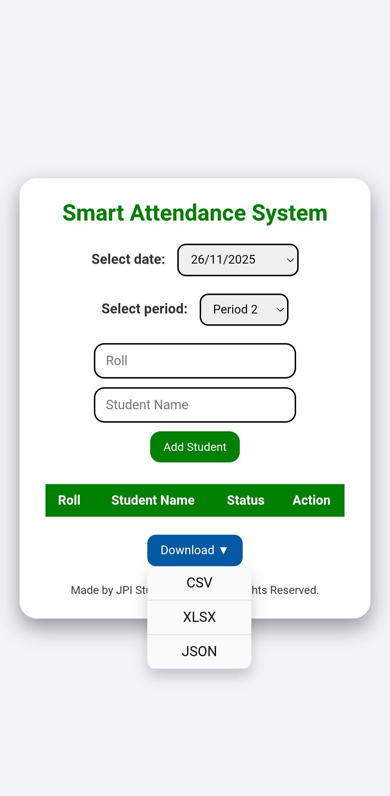

# Smart Attendance System

Smart Attendance System হলো একটি ওয়েব-বেসড অ্যাপ্লিকেশন যা শিক্ষার্থীদের হাজিরা (Attendance) ট্র্যাক এবং ম্যানেজ করার জন্য তৈরি। এটি **HTML, CSS, JavaScript** ব্যবহার করে তৈরি এবং **Local Storage** এ ডেটা সংরক্ষণ করে।  

**Live Demo:** [Click Here](#) *(আপনি GitHub Pages বা অন্য কোথাও হোস্ট করলে link বসাতে পারবেন)*

---

## 🌟 Features

- **Add Students:** শিক্ষার্থীদের নাম এবং রোল নম্বর দিয়ে অ্যাড করা যাবে।  
- **Edit / Delete Students:** রোল নম্বর এডিট এবং শিক্ষার্থী ডিলিট করা যাবে।  
- **Mark Attendance:** প্রতিদিনের তারিখ এবং পিরিয়ড অনুযায়ী "Present" বা "Absent" মার্ক করা যাবে।  
- **Export Attendance:** Single **Download ▼** dropdown থেকে ডেটা ডাউনলোড করা যাবে:
  - CSV
  - XLSX
  - JSON
- **Local Storage:** সকল তথ্য ব্রাউজারের Local Storage-এ সংরক্ষিত থাকে।  
- **Responsive Design:** Mobile এবং Desktop-friendly ডিজাইন।  

---

## 📸 Screenshots

---

## 🛠 Technologies Used

- HTML5  
- CSS3  
- JavaScript (ES6)  
- [SheetJS XLSX Library](https://cdnjs.com/libraries/xlsx) (XLSX Export)  
- Local Storage  

---

## 🚀 How to Use

1. **Clone or Download** this repository.  
2. Open `index.html` in your browser.  
3. **Select Date & Period:** আজকের তারিখ এবং পিরিয়ড নির্বাচন করুন।  
4. **Add Students:** রোল এবং নাম লিখে "Add Student" ক্লিক করুন।  
5. **Mark Attendance:** শিক্ষার্থীদের সামনে "Present" বা "Absent" ক্লিক করুন।  
6. **Export Attendance:** "Download ▼" dropdown থেকে CSV, XLSX বা JSON সিলেক্ট করে ডাউনলোড করুন।  

---

## 👨‍💻 Author

**Rakib JPI**  
Made for learning and managing student attendance efficiently.

---

## 📝 License

This project is **free to use** and modify. © Rakib